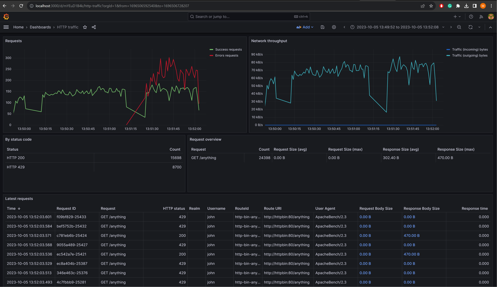

# Cloud Gateway

Cloud Gateway is a Docker-packaged reverse proxy built on Spring Cloud Gateway, offering full request/response logging,
including body content. It integrates with Grafana for traffic monitoring.

## Features

* Reverse proxy built on Spring Cloud Gateway.
* Full HTTP request/response logging, including headers and body.
* Dockerized deployment with Grafana for real-time monitoring.



## Getting Started

### Prerequisites

* [Docker](https://www.docker.com/) installed.
* `docker-compose` file provided in the `/docker` folder.

### Installation

1. **Clone the repository**:

   ```
   git clone https://github.com/ethlo/cloud-gateway.git
   cd cloud-gateway/docker
   ```

2. **Start the services**:

   ```
   docker-compose up -d
   ```

3. **Generate traffic**:

   ```
   curl -uuser:pass http://localhost:6464/get
   ```

4. **View results in Grafana**:

   Access Grafana at [http://localhost:3000](http://localhost:3000).

    * **Username**: `admin`
    * **Password**: `grafana`

   Select the dashboard named `HTTP traffic` from the left-hand menu to view traffic data.

## Configuration

### Main Configuration

The main configuration file is located in `config/application.yaml`.

### Logging Configuration

Cloud Gateway supports powerful and flexible logging configurations. Below is a sample configuration:

#### Basic Example:

```
http-logging:
  matchers:
    - id: API writes
      predicates:
        - Path=/**
        - NotMethod=GET
      request:
        headers:
          excludes:
            - X-My-App-Key
            - Session
        body: STORE
        raw: SIZE
```

#### Header Logging Options

* Configure lists of headers using `includes` and `excludes`.
* By default, all headers are included except for `Authorization`.

#### Body Logging Options

* `NONE`: No logging (default).
* `SIZE`: Logs the body size.
* `STORE`: Logs the full body content.

#### Raw Data Logging Options

* `NONE`: No logging (default).
* `SIZE`: Logs the request size.
* `STORE`: Logs the full raw request, including headers and body.

**Warning**: Storing raw data may include sensitive information such as usernames, passwords, and API keys.

For more details on logging in Spring Boot, see
the [official Spring documentation](https://docs.spring.io/spring-boot/how-to/logging.html#howto.logging.logback).

### Logging Providers

#### File-Based Logging

Log requests to a file using a customizable template pattern:

```
http-logging:
  providers:
    file:
      enabled: true
      pattern: '{{gateway_request_id}} {{method}} {{path}} {{request_headers["Content-Length"][0]}} {{status}}'
```

#### ClickHouse Logging

Log data to a ClickHouse table for detailed analysis:

```
http-logging:
  filter:
    request-headers:
      exclude: 
          # r = REDACT, default is DELETE
        - Authorization,r 
        - Api-Access-Key
  providers:
    clickhouse:
      enabled: true
      url: jdbc:ch://localhost:18123?database=default&async_insert=1,wait_for_async_insert=0
```

### Handling Unprocessed Requests

If the upstream server is down, the request contents may be lost. You can still capture the request by configuring a
fallback:

```
spring:
  cloud:
    gateway:
      routes:
        - id: my-upstream-is-down
          uri: http://my-service1
          predicates:
            - Path=/my-service
          filters:
            - name: CircuitBreaker
              args:
                name: upstream-down
                fallbackUri: forward:/upstream-down
```

### Running Behind a Reverse Proxy or WAF

If Cloud Gateway is behind a load balancer or firewall, configure it to handle forwarded headers properly:

```
server:
  forward-headers-strategy: NATIVE
```

For more information, refer to
the [Spring Boot documentation on using it behind a proxy server](https://docs.spring.io/spring-boot/how-to/webserver.html#howto.webserver.use-behind-a-proxy-server).

## Custom filters

### TemplateRedirect

It supports regexp named parameters, otherwise you can also use numeric variables like `{{1}}` and `{{2}}`. You also
have access to query paramters via `query`

Example shorthand:

```yaml
  filters:
    - TemplateRedirect=/foo/(?<var1>.*)/21/(?<var2>.*),https://example.com/{{var2}}?={{var1}},302
```

Example full:

```yaml
  filters:
    - name: TemplateRedirect
      source: /foo/(?<var1>.*)/21/(?<var2>.*)
      target: https://example.com/{{var2}}?={{var1}}
      status: 301 # default is 302
```

### InjectBasicAuth

Allows the injection of basic auth credentials before forwarding the request upstream

```yaml
filters:
- name: InjectBasicAuth
  args:
    username: ${SECRET_USERNAME}
    password: ${SECRET_PASSWORD}
```

## Custom predicates

### NotPath

Negated version
of [Path](https://cloud.spring.io/spring-cloud-gateway/multi/multi_gateway-request-predicates-factories.html#_path_route_predicate_factory).

```yaml
- NotPath=/secret
```

### NotMethod

Negated version
of [Method](https://cloud.spring.io/spring-cloud-gateway/multi/multi_gateway-request-predicates-factories.html#_method_route_predicate_factory).

```yaml
- NotMethod=GET
```

### NotHost

Negated version
of [Host](https://cloud.spring.io/spring-cloud-gateway/multi/multi_gateway-request-predicates-factories.html#_host_route_predicate_factory).

```yaml
- NotHost=sub.example.com
```

### NotExtension

Without any listed extension, it will skip all URLs ending with an extension.

Example config for not logging anything with an extension (like `file.js`, `file.css`, etc.):

```yaml
- NotExtension=
```

Example config fo skipping specific extensions. Other extensions like `file.zip` would still be let through:

```yaml
- NotExtension=html,css,js
```

## Serving static resources

When serving static resources, one can define multiple layers, where the first layers are taking precedence over later defined layers. This allows to share common files, but override specific ones where needed. 

The `application.yaml` can define multiple instances of LayeredFileSystem.

```yaml
static-files:
   url-prefix: myfiles # default prefix is `files`
   directories:
      mydir1:
         - /path/to/layer1/for/mydir1
         - /path/to/layer2/for/mydir1
      mydir2:
         - /path/to/layer1/for/mydir2
         - /path/to/layer2/for/mydir2
         - /path/to/layer3/for/mydir2
```

For example, the files from `mydir1` will be available under `/files/mydir1/<file>`.

The prefix can be adjusted with the `static-files.url-prefix` setting as shown above.

#### An example with 3 layers:
```
            ▼
┌──────────────────────────┐
│        [Layer 1]         │ ▶ Not found, continue
└──────────────────────────┘
            ▼         
┌──────────────────────────┐
│        [Layer 2]         │ ▶ Not found, continue
└──────────────────────────┘
            ▼
┌──────────────────────────┐
│        [Layer 3]         │ ▶ Found, return contents
└──────────────────────────┘
```

* Layer 1: The request checks Layer 1 first. Since the file is not present, the system moves to the next layer.
* Layer 2: The system checks Layer 2, where the file is also not found.
* Layer 3: The file is finally located in Layer 3, so the system retrieves it from this layer.
This approach maintains a fallback order, with each layer serving as a backup if the file is not available in the layers above it.

## Monitoring with Grafana

Grafana is set up to visualize traffic data logged by Cloud Gateway. Access Grafana
at [http://localhost:3000](http://localhost:3000) and view the `HTTP traffic` dashboard to monitor real-time traffic.

## References

For more detailed documentation, refer to:

* [Spring Cloud Gateway Reference](https://cloud.spring.io/spring-cloud-gateway/)
* [Spring Boot Documentation](https://docs.spring.io/spring-boot/docs/current/reference/html/)
* [Docker Documentation](https://docs.docker.com/)

## Guides

For practical use cases and guides on how to extend the functionalities of Cloud Gateway, you may refer to:

* [Building a microservices gateway](https://spring.io/guides/gs/gateway/)
* [Getting started with Spring Boot](https://spring.io/guides/gs/spring-boot/)
* [Monitor your services with Grafana](https://grafana.com/docs/grafana/latest/getting-started/getting-started-grafana/)

## Contributing

Contributions are welcome! Please submit issues or pull requests via
the [GitHub repository](https://github.com/ethlo/cloud-gateway).

## License

This project is licensed under the Apache 2 License.